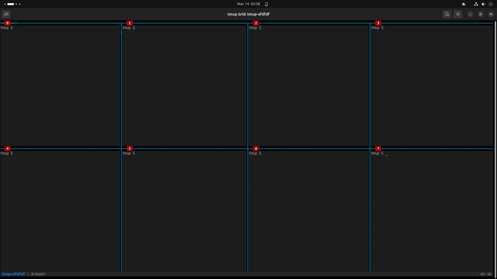
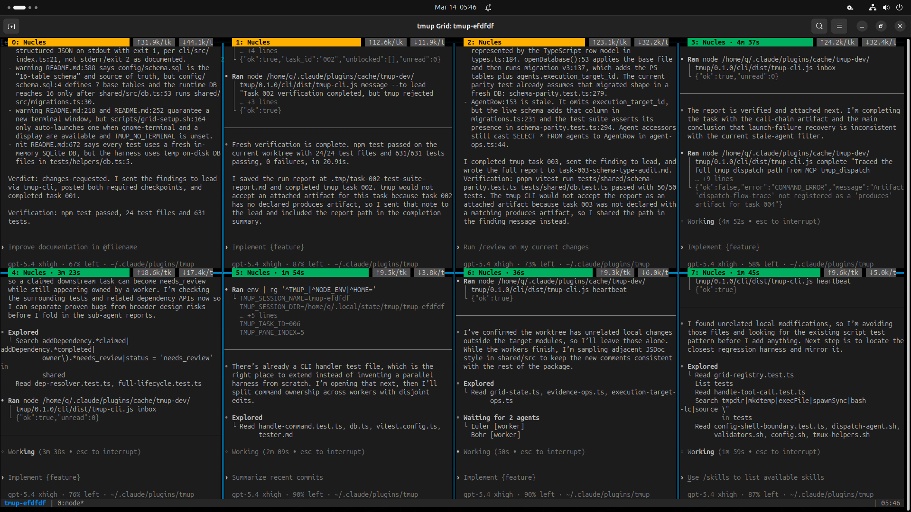

# tmup

**tmux + team up = tmup**

Claude Code and Codex CLI. Together. In a tmux grid. Talking to each other through a shared SQLite database while you watch them argue about your codebase in real time.

```
  Claude Code (lead)         tmux 2x4 grid
  +----------------+     +----+----+----+----+
  | "I'll break    |---->| C1 | C2 | C3 | C4 |  Codex workers
  |  this into     |     +----+----+----+----+  (8 panes)
  |  8 tasks"      |     | C5 | C6 | C7 | C8 |
  +-------+--------+     +----+----+----+----+
          |                    |
          +------ SQLite WAL --+
               (shared brain)
```

One Claude Code session orchestrates. Up to 8 Codex CLI workers execute. They coordinate through a task DAG backed by SQLite WAL mode. Dependencies cascade. Failed tasks retry. Dead workers get their claims recovered. You get to lean back and watch a small army of AI agents build your project in parallel.

## Documentation

| | |
|---|---|
| **[Architecture](docs/ARCHITECTURE.md)** | How it works: task DAG, lifecycle state machine, agent roles, concurrency model, dead claim recovery, inter-agent messaging |
| **[API Reference](docs/API.md)** | All 18 MCP tools + 9 CLI commands with input/output examples |
| **[Configuration](docs/CONFIGURATION.md)** | Grid layout, DAG behavior, autonomy tiers, project structure |
| **[Development](docs/DEVELOPMENT.md)** | Dev workflow, cache sync, test coverage (631 tests) |
| **[FAQ & Limitations](docs/FAQ.md)** | Answers to questions you haven't asked yet, and honest limitations |
| **[SYSTEM-INVENTORY.md](SYSTEM-INVENTORY.md)** | The full 46 KB engineering manual. Everything is in there. |

---

## What is this

tmup is a [Claude Code plugin](https://docs.anthropic.com/en/docs/claude-code/plugins) that turns your terminal into a multi-agent war room:

- **Claude Code** is the lead. It plans the work, creates a task DAG, dispatches workers, monitors progress, and harvests results. It is the adult in the room. It signed the lease.
- **Codex CLI** workers run in tmux panes. Each one claims tasks, writes code, checkpoints progress, and reports back. They are the interns. Talented, tireless, occasionally confused interns with 1M token context windows.
- **SQLite WAL** is the shared brain. One writer, many readers. No network. No API. Just a file on disk that 9 AI agents hammer concurrently. It has never once complained.
- **tmux** is the grid. You can see every agent working in real time. You can watch them read your code, judge your architecture, and silently disagree with your variable names. You can watch them. They cannot watch you. This is the correct power dynamic.

## Why this exists

You know that feeling when you're staring at a 47-task implementation plan and you think "I wish I had eight of me"? And then you realize that you kind of do, except they're made of math and they don't need coffee?

tmup exists because:

1. **Claude Code is an incredible orchestrator** but it works alone. One session. One thread. One very smart entity doing one thing at a time.
2. **Codex CLI is an incredible worker** but it has no idea what anyone else is doing. It's just a guy in a room with a terminal.
3. **tmux gives you the rooms.** Eight rooms, to be precise. Arranged in a grid. With labels.
4. **SQLite gives them a shared brain.** One file. WAL mode. ACID transactions. The most boring, reliable piece of technology in the entire stack.

Put them together and you get a multi-agent system where the planning happens in one AI, the execution happens in eight other AIs, and the coordination happens through a database file that was originally designed for embedded devices. It's held together by bash scripts and optimism and it works disturbingly well.

This is not a framework. This is not a platform. This is a Claude Code plugin that spawns Codex processes into tmux panes and gives them a SQLite database to argue through. The fact that it produces working software is, frankly, an accident of engineering that we have chosen not to question.

### It's agents all the way down

Here's where it gets properly unhinged. Claude Code can spawn **sub-agents** -- background workers that handle research, code review, exploration. Codex can also spawn sub-agents within its own sessions. So what you actually have is:

```
You (human, allegedly)
 +-- Claude Code (lead, 1M context)
      +-- Claude sub-agent: research     (200K context)
      +-- Claude sub-agent: code review  (200K context)
      +-- tmux pane 0: Codex worker      (1M context)
      |    +-- Codex sub-agent: explore   (nested)
      |    +-- Codex sub-agent: test      (nested)
      +-- tmux pane 1: Codex worker      (1M context)
      |    +-- Codex sub-agent: refactor  (nested)
      +-- tmux pane 2: Codex worker      (1M context)
      |    +-- ...
      +-- ... (8 panes, each with potential sub-agents)
```

Russian nesting dolls of AI agents. The lead spawns workers. The workers spawn sub-workers. The sub-workers could theoretically spawn sub-sub-workers but at that point you're just running a small civilization on your laptop and your electricity bill will reflect that.

Each Codex worker is a full Codex session, not a toy. It has its own context window, its own tool access, its own ability to read files, run commands, and make decisions. When a worker needs to explore a codebase before modifying it, it can spawn an exploration sub-agent. When it needs to run and debug tests, it can spawn a test sub-agent. The workers are not just executors -- they're autonomous problem-solvers with delegation abilities.

### The numbers

| Configuration | Lead | Workers (x8) | Combined context |
|--------------|------|-------------|-----------------|
| Claude Opus 4.6 (1M) + Codex GPT-5.4 (1M) | 1M tokens | 8M tokens | **9M tokens** |
| Claude Sonnet 4.6 (200K) + Codex GPT-4.1 (200K) | 200K tokens | 1.6M tokens | **1.8M tokens** |
| Claude Opus 4.6 (1M) + Codex GPT-4.1 (200K) | 1M tokens | 1.6M tokens | **2.6M tokens** |

Up to **9 million tokens** of combined context. That's roughly 7 million words. Twelve copies of War and Peace. You could also just build software. We recommend the second option but we're not your parents.

---

## Prerequisites

- [Claude Code](https://docs.anthropic.com/en/docs/claude-code) (CLI) - the adult in charge
- [Codex CLI](https://github.com/openai/codex) (`~/.local/bin/codex` or in PATH) - the workforce
- [tmux](https://github.com/tmux/tmux) >= 3.0 - the office building
- Node.js >= 20 - because everything is JavaScript eventually
- jq - because parsing JSON with grep is a war crime

## Installation

```bash
# Clone this repo into your Claude Code plugins directory
git clone https://github.com/LucasQuiles/tmup.git ~/.claude/plugins/tmup

# Install dependencies and build
cd ~/.claude/plugins/tmup
npm install && npm run build

# Install the plugin into Claude Code
claude plugin install tmup@tmup-dev
```

That's three commands. If you can't handle three commands you are not ready for nine concurrent AI agents.

<details>
<summary>Manual registration (if <code>plugin install</code> doesn't work)</summary>

Add to `~/.claude/settings.json`:

```json
{
  "extraKnownMarketplaces": {
    "tmup-dev": {
      "source": { "source": "directory", "path": "~/.claude/plugins/tmup" }
    }
  },
  "enabledPlugins": {
    "tmup@tmup-dev": true
  }
}
```

Then restart Claude Code.

</details>

<details>
<summary>Permissions for <code>dontAsk</code> mode</summary>

If you run Claude Code with `defaultMode: "dontAsk"`, the tmup MCP tools need explicit permission. The `mcp__*` wildcard does **not** override an explicit allow list in `settings.local.json`. Add to `~/.claude/settings.local.json`:

```json
{
  "permissions": {
    "allow": [
      "mcp__plugin_tmup_tmup__tmup_init",
      "mcp__plugin_tmup_tmup__tmup_status",
      "mcp__plugin_tmup_tmup__tmup_next_action",
      "mcp__plugin_tmup_tmup__tmup_task_create",
      "mcp__plugin_tmup_tmup__tmup_task_batch",
      "mcp__plugin_tmup_tmup__tmup_task_update",
      "mcp__plugin_tmup_tmup__tmup_claim",
      "mcp__plugin_tmup_tmup__tmup_complete",
      "mcp__plugin_tmup_tmup__tmup_fail",
      "mcp__plugin_tmup_tmup__tmup_cancel",
      "mcp__plugin_tmup_tmup__tmup_checkpoint",
      "mcp__plugin_tmup_tmup__tmup_send_message",
      "mcp__plugin_tmup_tmup__tmup_inbox",
      "mcp__plugin_tmup_tmup__tmup_dispatch",
      "mcp__plugin_tmup_tmup__tmup_harvest",
      "mcp__plugin_tmup_tmup__tmup_pause",
      "mcp__plugin_tmup_tmup__tmup_resume",
      "mcp__plugin_tmup_tmup__tmup_teardown"
    ]
  }
}
```

Restart Claude Code after updating.

</details>

---

## Quick start

Inside a Claude Code session:

```
> /tmup
```

That's it. Claude will initialize a session, create a tmux grid, ask what you want built, break it into a task DAG, dispatch Codex workers, and coordinate the whole thing. One command. You go get coffee. You come back and there's a PR.

### What it looks like

Empty grid after `grid-setup.sh` -- 8 panes, waiting for dispatch:



Full grid with 8 Codex workers running reviews, tests, audits, and documentation in parallel:



### What the backend looks like

Real output from a tmup session where we used tmup to review tmup:

```json
{
  "ok": true,
  "tasks": [
    {
      "id": "001", "subject": "Review README.md for accuracy",
      "role": "reviewer", "status": "completed",
      "result_summary": "changes-requested: README has 5 accuracy issues covering the events --type flag, CLI error exit semantics, schema source-of-truth wording, test DB wording, and terminal auto-launch behavior.",
      "completed_at": "2026-03-14T09:45:11.550Z"
    },
    {
      "id": "005", "subject": "Deep audit using sub-agents for parallel exploration",
      "role": "investigator", "status": "claimed",
      "result_summary": "Launched two nested Codex sub-agents: one auditing task lifecycle and dependency resolution, one auditing session and agent operations."
    }
  ],
  "agents": [
    {"id": "549cefe9-...", "pane_index": 4, "role": "investigator", "status": "active"},
    {"id": "4b7a2219-...", "pane_index": 5, "role": "tester", "status": "active"},
    {"id": "3521112a-...", "pane_index": 6, "role": "documenter", "status": "active"}
  ],
  "unread": 18
}
```

Real messages from workers to the lead:

```json
{
  "ok": true,
  "messages": [
    {
      "from": "a6ddcc67-d1f2-4a66-84eb-409d63e2c8db",
      "type": "checkpoint", "task_id": "002",
      "payload_framed": "[WORKER MESSAGE from a6ddcc67, type=checkpoint, task=002]:\nTester checkpoint: fresh npm test completed successfully with 24/24 files and 631/631 tests passing in 20.91s; recording evidence artifact and closing task 002.\n[END WORKER MESSAGE]"
    },
    {
      "from": "e1c5dc3e-f5a7-4299-a6e1-5a47c105a984",
      "type": "finding",
      "payload_framed": "[WORKER MESSAGE from e1c5dc3e, type=finding]:\nDispatch-path finding: mcp-server marks the agent shutdown on launch failure, but dead-claim recovery only scans status='active'. The task remains claimed by the shutdown agent, so the current cleanup does not actually make the task recoverable.\n[END WORKER MESSAGE]"
    },
    {
      "from": "549cefe9-1a1c-4602-939a-bd026ee2d691",
      "type": "checkpoint", "task_id": "005",
      "payload_framed": "[WORKER MESSAGE from 549cefe9, type=checkpoint, task=005]:\nLaunched two nested Codex sub-agents: one auditing task lifecycle and dependency resolution, one auditing session and agent operations. I am tracing supporting call paths locally while they read the target modules.\n[END WORKER MESSAGE]"
    }
  ]
}
```

That last message is the nesting in action. A Codex worker dispatched by tmup spawned its own sub-agents to parallelize an audit. Agents spawning agents, coordinating through a shared SQLite file, reporting back to a lead that's running in a completely different AI system.

---

## License

[MIT](LICENSE). Do whatever you want. Give it to your friends. Give it to your enemies. Fork it and rename it "smux" (please don't actually do this).

## Credits

Built with unreasonable enthusiasm by [@LucasQuiles](https://github.com/LucasQuiles) and a mass of AI agents who, at one point, were deployed to review the very system that deployed them. They found bugs. They were not disturbed by the recursion. We were.

Powered by [Claude Code](https://docs.anthropic.com/en/docs/claude-code) and [Codex CLI](https://github.com/openai/codex).
